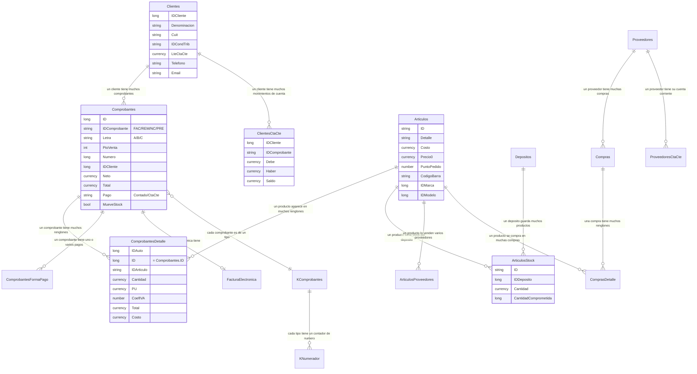

# Análisis del sistema de gestión — Casa de repuestos ("Bulonería")

> Documento pensado para que lo entienda cualquier persona, técnica o no.
> Cada afirmación cita el nombre real de la tabla, campo o archivo para poder verificarla.
> Lo que no se puede determinar con lo que hay, se aclara explícitamente.

**Base de datos analizada:** `BasesBuloneria20260622` (la copia más reciente).
**Programa:** `Buloneria.exe` (Delphi 5, motor de datos BDE + tablas Paradox `.DB`).
**Empresa activa en los datos:** "Casa de Repuestos Demo" / carpeta fiscal `EMPRESA_DEMO`.

---

## 1. Resumen ejecutivo

Es un **sistema de gestión comercial de escritorio** (ERP chico) para una casa de
repuestos/bulonería en Argentina. Maneja el circuito completo de un comercio: catálogo de
productos con lista de precios y stock por depósito (`Articulos`, `ArticulosStock`),
compras a proveedores (`Compras`, `Proveedores`), ventas y facturación con emisión de
comprobantes fiscales tipo A/B/C y **factura electrónica AFIP con CAE**
(`Comprobantes`, `FacturaElectronica`), cuenta corriente de clientes y proveedores
(`ClientesCtaCte`, `ProveedoresCtaCte`), caja diaria y cheques (`CajaIngresos`,
`CajaEgresos`, `ChequeMovimientos`). Hoy la base tiene ~**2.000 productos**, ~**900 clientes**,
~**12.000 comprobantes** con ~**110.000 renglones** de venta y ~**1.065 CAE** emitidos.
Técnicamente es un programa viejo (Delphi 5, del año ~1999) sobre una base de datos de
archivos planos (Paradox), sin servidor de base de datos: es robusto para lo que hace,
pero frágil y cerrado para integrarle cosas nuevas.

---

## 2. Modelo de datos

### 2.1 Las entidades principales (en criollo)

| Entidad (tabla) | Qué guarda | Clave |
|---|---|---|
| **Articulos** | El catálogo: cada repuesto/producto. Código, descripción, costo, **4 listas de precio** (`Precio0..Precio3` con sus `Margen0..3`), `CostoDolar`, `PuntoPedido` (stock mínimo), código de barra, rubro, marca, modelo. | `ID` (texto, hasta 20) |
| **ArticulosStock** | Cuánto hay de cada producto **en cada depósito**. | `ID` + `IDDeposito` |
| **ArticulosProveedores** | Qué proveedores venden cada producto y a qué costo (`CodigoProveedor`). | `ID` + `IDProveedor` |
| **Clientes** | Los clientes: razón social, CUIT, condición fiscal, `LteCtaCte` (límite de crédito), vendedor asignado, teléfono, email, zona. | `IDCliente` (número) |
| **Proveedores** | Los proveedores: razón social, CUIT, datos de retenciones (`TasaRet`, `EGan`, `ERen`), días de vencimiento. | `ID` (texto, hasta 6) |
| **Comprobantes** | **La cabecera de cada venta/comprobante**: tipo (`IDComprobante`: FAC, REM, PRE, NC…), letra A/B/C, punto de venta, número, cliente, CUIT, `Neto`, `Total`, si mueve stock, si es contado o cuenta corriente (`Pago`). | `ID` interno + `IDEmpresa` |
| **ComprobantesDetalle** | **Los renglones de cada comprobante**: qué artículo, cantidad, precio unitario (`PU`), IVA (`CoefIVA`), total del renglón, costo. | `IDAuto`; se une por `ID` |
| **ComprobantesFormaPago** | Con qué medios se pagó cada venta (efectivo, tarjeta, cheque…), montos e interés. | `IDTransaccion` |
| **ClientesCtaCte** | El "libro mayor" del cliente: cada movimiento de deuda/pago (`Debe`, `Haber`, `Saldo`). | por `IDCliente` |
| **Compras / ComprasDetalle** | Facturas de compra a proveedor y sus renglones; discriminan `NetoGravado`, `IVA`, percepciones. | por proveedor + número |
| **ProveedoresCtaCte** | El "libro mayor" del proveedor (lo que le debemos). | por `IDProveedor` |
| **CajaIngresos / CajaEgresos** | Movimientos de caja por turno y concepto. | `ID` |
| **ChequeMovimientos** | Cartera de cheques: banco, número, fechas, si está `Conciliado`. | `Auto` |
| **FacturaElectronica** | Por cada comprobante electrónico guarda el XML `Enviado`, el `Recibido`, el `Ticket` y el **`CAE`** de AFIP. | `IDAuto` (= `Comprobantes.ID`) |
| **KComprobantes** | **Maestro de tipos de comprobante**: define cada tipo (FAC/REM/NC…), su numerador, el `Signo` (+1 suma, −1 resta), si mueve stock, impresora y copias. | `IDComprobante` + `Letra` |
| **KNumerador** | El **contador de números** de cada tipo de comprobante por punto de venta. | `IDNumerador` + `PtoVenta` |
| **Empresas / Depositos / Vendedores / Usuarios** | Tablas de apoyo: multi-empresa, depósitos, vendedores, y usuarios/claves del sistema. | — |

### 2.2 Diagrama de relaciones (ER) de las tablas clave



### 2.3 Cómo se relacionan, en lenguaje simple

- **Un cliente tiene muchos comprobantes.** `Comprobantes.IDCliente` apunta a `Clientes.IDCliente`.
- **Un comprobante tiene muchos renglones (ítems).** Cada renglón en `ComprobantesDetalle`
  guarda `ID` igual al `ID` del comprobante. Cada renglón **apunta a un producto** por
  `ComprobantesDetalle.IDArticulo` = `Articulos.ID`.
- **Un producto tiene stock repartido por depósito.** `ArticulosStock` tiene una fila por
  producto y depósito con la `Cantidad`. El stock total es la suma de todas sus filas
  (el programa lo calcula así: `SELECT SUM(Cantidad) FROM ArticulosStock WHERE ID = …`).
- **Un producto puede venir de varios proveedores.** `ArticulosProveedores` lo vincula, con
  el costo y el código que usa ese proveedor.
- **Cada tipo de comprobante define su comportamiento.** `KComprobantes` dice, para cada tipo
  (factura, remito, nota de crédito…), si suma o resta con el campo `Signo` (una nota de
  crédito tiene `Signo` negativo) y si `MueveStock`. El número lo lleva `KNumerador`.
- **La cuenta corriente es un libro mayor.** Cada venta a crédito genera un `Debe` en
  `ClientesCtaCte`; cada cobro, un `Haber`. El `Saldo` es la deuda acumulada.
- **La factura electrónica se cuelga del comprobante.** `FacturaElectronica.IDAuto` es el
  mismo `ID` del `Comprobantes`, y ahí queda guardado el `CAE` que devuelve AFIP.

---

## 3. Flujos de negocio, contados como historia

### 3.1 Alta de un repuesto y control de stock

1. Se crea el producto en **`Articulos`**: se le pone un código (`ID`, texto), descripción
   (`Detalle`), costo (`Costo` / `CostoDolar`), sus **cuatro precios de venta**
   (`Precio0` a `Precio3`, cada uno con su `Margen`), el `PuntoPedido` (stock mínimo deseado),
   el `CodigoBarra`, rubro/marca/modelo.
2. El stock inicial se registra en **`ArticulosStock`** (una fila por depósito, campo `Cantidad`).
   Si hay varios depósitos (`Depositos`), cada uno lleva su cantidad.
3. A partir de ahí, **cada venta o compra que "mueve stock"** ajusta `ArticulosStock.Cantidad`.
   Quién mueve stock y quién no lo decide la bandera `MueveStock` del comprobante y del tipo
   (`KComprobantes.MueveStock`). *Nota: Paradox no tiene "triggers"; el ajuste lo hace el
   programa, no la base — es lógica de la aplicación.*

> **Dato importante y honesto:** la tabla **`ArticulosMovimientos`** (transferencias entre
> depósitos) está **vacía (0 registros)**. Y las tablas de compatibilidad por vehículo
> (`Vehiculos`, `VehiculosGrupos`) también están **en cero**. Es decir: el diseño soporta
> compatibilidad de repuestos por vehículo, pero **nunca se cargó ese dato**.

### 3.2 Compra a proveedor y su impacto en el stock

1. Llega la factura del proveedor. Se carga la **cabecera en `Compras`**: proveedor
   (`IDProveedor`), número, tipo, y los importes discriminados: `NetoGravado`,
   `NetoNoGravado`, `IVA`, `IVA105`/`IVA27` (alícuotas), percepciones (`Perc1..3`, `IB`),
   `Total`, vencimiento (`FechaVto`).
2. Los **renglones van a `ComprasDetalle`**: `IDArticulo`, `Cantidad`, precio unitario (`PU`),
   `Costo`, `IVA`.
3. Si la compra `MueveStock`, **suma** a `ArticulosStock.Cantidad`. El costo del artículo
   puede actualizarse (`Articulos.Costo` / `UltimaCompra` / `FechaUltimaCompra`).
4. La deuda con el proveedor se asienta en **`ProveedoresCtaCte`** como `Debe`.

### 3.3 Venta al cliente, de principio a fin

1. Se elige el cliente (`Clientes`) y el tipo de comprobante (`KComprobantes`).
2. Se cargan los renglones: por cada producto se toma el precio de la lista que corresponda
   (`Articulos.Precio0..3`, según `Comprobantes.ListaPrecio`) y se arma
   **`ComprobantesDetalle`** (cantidad, `PU`, `CoefIVA`, `Total`).
3. Se calcula el pie: `Neto`, IVA y `Total` en la cabecera **`Comprobantes`**.
4. Al confirmar:
   - Si el tipo `MueveStock`, se **descuenta** de `ArticulosStock`.
   - Si es **contado** (`Pago='C'`), el pago se registra en `ComprobantesFormaPago` y entra a caja.
   - Si es **cuenta corriente**, se genera el `Debe` en `ClientesCtaCte`.
5. Si es un comprobante fiscal electrónico, se pide el **CAE** a AFIP y se guarda en
   `FacturaElectronica` (ver 3.4).

### 3.4 Facturación en detalle

**Numeración.** Hay dos números distintos:
- Un **`ID` interno** correlativo del comprobante, que el programa saca con
  `Select Max(ID)+1 as ID From Comprobantes` (⚠️ ver riesgos: esto es peligroso con varios
  usuarios simultáneos).
- El **número fiscal** (`Numero`), que lleva `KNumerador` por punto de venta; al facturar se
  hace `update KNumerador set Numero=…`.

**Tipos y letras.** El tipo vive en `Comprobantes.IDComprobante` (código de 3 letras: `FAC`
factura, `REM` remito, `PRE` presupuesto, `NC` nota de crédito, `REC` recibo, etc.) y la
**letra fiscal** en `Comprobantes.Letra` (`A`, `B`, `C`). El comportamiento de cada tipo lo
define **`KComprobantes`**: el campo **`Signo`** determina si suma (+1) o resta (−1) —por eso
una **nota de crédito** tiene `Signo` negativo y revierte stock y cuenta corriente— y
`MueveStock` define si toca inventario. Un **remito** típicamente mueve stock pero no factura;
un **presupuesto** (`PRE`) no mueve stock ni cuenta corriente.

**Vínculo entre documentos.** Una nota de crédito o una factura desde remito referencia al
original con `IDComprobanteOrigen` / `IDComprobanteOrigenNC` en `Comprobantes`
(y tablas `RefRemitoComprobantes` para el armado factura↔remito).

**AFIP / factura electrónica.** Los comprobantes electrónicos se identifican porque su tipo
en `KComprobantes.Detalle` contiene `ELEC` (visto en el SQL:
`… where Upper(Detalle) like '%ELEC%'`). Por cada uno se guarda en **`FacturaElectronica`** el
XML `Enviado`, el `Recibido`, el `Ticket` y el **`CAE`** (número de autorización). El programa
sabe cuáles faltan autorizar con una consulta del estilo *"comprobantes cuyo `ID` no está en
`FacturaElectronica`"*.

> **Lo que NO se pudo determinar con certeza:** el mecanismo exacto de comunicación con AFIP
> (WSAA/WSFEv1). El programa principal **intercambia archivos XML** en la carpeta
> `C:\FacturaElectronica\` (`Enviado.xml` / `Recibido.xml`), lo que sugiere que **el llamado
> real al web service lo hace un componente externo**, no el `Buloneria.exe` que analicé. No
> encontré en el exe las URLs del web service de AFIP. Esto conviene confirmarlo mirando qué
> otro ejecutable o servicio consume esa carpeta.

### 3.5 Cobros, cuenta corriente y caja

1. **Cuenta corriente del cliente.** La deuda vive en `ClientesCtaCte` como suma de `Debe` −
   `Haber`. El saldo total se obtiene con `Select Sum(Saldo) from ClientesCtaCte where IDCliente=…`.
   El límite de crédito está en `Clientes.LteCtaCte`.
2. **Cobro.** Se emite un **recibo** (`IDComprobante='REC'`, `Letra='R'`), que genera un `Haber`
   en `ClientesCtaCte` y baja el saldo. El detalle de con qué se cobró (efectivo, cheque,
   tarjeta) va a `CLIENTESCTACTEFORMAPAGO`.
3. **Caja.** Los ingresos y egresos de dinero quedan en `CajaIngresos` / `CajaEgresos`, por
   `IDTurno` y `IDConcepto`. Los cheques recibidos se administran en `ChequeMovimientos`
   (con estado y `Conciliado`), y los movimientos bancarios en `BancoMovimientos`.

---

## 4. Errores, riesgos y deuda técnica

Citando lo concreto que se ve en el sistema:

1. **Numeración con riesgo de duplicados (concurrencia).** `Select Max(ID)+1 From Comprobantes`
   y `Select Max(Numero)+1` son el patrón clásico que **falla con varios usuarios a la vez**:
   dos cajas pueden tomar el mismo número. En Paradox (sin transacciones fuertes) esto es un
   riesgo real de comprobantes duplicados o salteados.
2. **Contraseñas en texto plano.** `Usuarios.Clave` es `Alpha(10)` y `Supervisor.Clave`
   `Alpha(10)`: claves de hasta 10 caracteres, **guardadas sin cifrar** (no hay hashing
   evidente). Cualquiera que abra la tabla ve las claves. Riesgo de seguridad alto.
3. **Motor de datos frágil (Paradox/BDE).** Son archivos planos: se **corrompen** con cortes
   de luz o red inestable. Señales de que ya pasó: existe la carpeta `pdoxrepair` con
   `TUTIL32.DLL` (reparador de tablas), tablas de respaldo como `ChequeMovimientosBK`, y un
   `LogError.DB` de **2,6 MB** (muchos errores registrados). El motor **no fuerza integridad
   referencial**: nada impide un renglón que apunte a un artículo que no existe.
4. **Claves con anchos inconsistentes (riesgo de truncado).** El código de artículo es
   `Articulos.ID` `Alpha(20)`, pero se lo referencia como `Alpha(6)` en
   `ArticulosMovimientos.IDArticulo` y `ComprobantesDetalle.IDArticuloAuxi`. Códigos largos
   pueden **cortarse** al cruzarse entre tablas.
5. **Datos duplicados y "copias basura" en la misma carpeta.** Conviven la tabla viva y
   decenas de copias fechadas o marcadas como malas: `Articulos20250129`,
   `ClientesCtaCteMAL20250312`, `CLIENTESCTACTEFORMAPAGOMAL…`, `IvaDef10072024`, etc. Ensucian
   el modelo y son una bomba si alguna herramienta las lee por error.
6. **Saldos guardados Y recalculados.** El saldo existe como columna (`ClientesCtaCte.Saldo`,
   `Proveedores.SALDO`) **y** se recalcula con `SUM`. Si el proceso se interrumpe, el guardado
   y el calculado **se desincronizan** (saldos que no cierran).
7. **Rutas y datos "hardcodeados".** Aparecen `C:\FacturaElectronica\`, `C:\Delphi5\…`,
   `c:\temp\ComprobantesDetalle.db`. Ata el sistema a una PC/estructura concreta y complica
   mover o respaldar.
8. **IVA en columnas opacas.** El IVA discriminado se guarda en `Comprobantes.VGB1..VGB4` y
   `KGB1..KGB4` (aparentemente "baldes" por alícuota, sin nombre claro). **Difícil de auditar**
   sin la lógica interna; conviene validar contra los totales de AFIP.
9. **Tecnología sin soporte.** Delphi 5 (≈1999), 32 bits, fechas `Date(4)`. Sin mantenimiento
   del fabricante, difícil de contratar quien lo mantenga, y en riesgo con Windows nuevos.
10. **Plantilla multi-rubro con "módulos muertos".** Hay tablas de otros rubros que este
    negocio no usa (`KDrogas`, `KGranos`, `KCapsulas`, `KBlister`, `ArticulosCristales`,
    `ArticuloSurtidor`). Es el mismo programa vendido a farmacias/agro/estaciones; confunde
    y agranda la superficie de error.

---

## 5. Oportunidades de automatización e IA  ⭐ (la parte clave)

> **Principio de arquitectura para TODAS estas ideas:** el sistema vivo es frágil y cerrado
> (Paradox/BDE). No conviene que un agente le escriba directo. El **habilitador de casi todo**
> es montar un **espejo de solo lectura**: sincronizar las tablas Paradox → una base moderna
> (PostgreSQL/SQLite) de forma periódica, y construir la IA sobre ese espejo. Si en algún caso
> hay que escribir de vuelta, se hace por una cola controlada. Ese espejo es el proyecto
> fundacional. **Dificultad: media** — es leer archivos `.DB` (ya demostramos que se puede
> parsear el esquema) y volcarlos.

### Ideas ordenadas por relación valor / esfuerzo

**A. Reposición inteligente de stock**
- *Problema:* se compra "a ojo"; hay quiebres y sobre-stock.
- *Cómo se engancha:* ya existe `Articulos.PuntoPedido` (mínimo) y `ArticulosStock.Cantidad`
  (actual). Cruzando con la **velocidad de venta** (histórico de `ComprobantesDetalle` por
  artículo y fecha) y el proveedor por defecto (`Articulos.IDProveedor` / `ArticulosProveedores`),
  un agente arma **sugerencias de orden de compra** por proveedor.
- *Dificultad:* **baja-media**. Los datos existen; falta el modelo de demanda.

**B. Conciliación / control de facturación electrónica (CAE)**
- *Problema:* comprobantes que quedaron sin CAE, o rechazos de AFIP que pasan inadvertidos.
- *Cómo se engancha:* comparar `Comprobantes` contra `FacturaElectronica` (`IDAuto`, `CAE`).
  El propio sistema ya tiene la consulta de "comprobantes sin CAE"; un agente la corre en
  automático, lee el XML `Recibido` para detectar rechazos y **alerta**.
- *Dificultad:* **media**. Requiere leer/parsear los XML de `FacturaElectronica`.

**C. Cobranzas y recordatorios de cuenta corriente por WhatsApp/email**
- *Problema:* mora de clientes; nadie persigue los saldos a tiempo.
- *Cómo se engancha:* `ClientesCtaCte.Saldo` por cliente + `Clientes.Telefono` / `Clientes.Email`
  + `Clientes.LteCtaCte` (límite). Un agente detecta **mora** y **clientes cerca del límite de
  crédito**, y manda recordatorios personalizados.
- *Dificultad:* **media**. Ojo con la **calidad de los teléfonos/emails** (campos libres, sin validar).

**D. Asistente de precios y márgenes**
- *Problema:* ventas por debajo del costo. El sistema **ya grita "Margen NEGATIVO!!"** pero es
  reactivo.
- *Cómo se engancha:* recorrer `Articulos` (`Costo`/`CostoDolar` vs `Precio0..3`/`Margen0..3`),
  detectar márgenes negativos o desactualizados por tipo de cambio, y **proponer recomposición
  de precios** cuando cambia el dólar (`CotizacionDolar`).
- *Dificultad:* **baja**. Todo está en una tabla.

**E. Atención por WhatsApp: consulta de stock y precio**
- *Problema:* el mostrador pierde tiempo respondiendo "¿tenés tal repuesto?, ¿a cuánto?".
- *Cómo se engancha:* un bot de solo lectura sobre `Articulos` (descripción, `CodigoBarra`) +
  `ArticulosStock` (disponible). Búsqueda semántica sobre `Detalle`/`Descripcion1`.
- *Dificultad:* **media**. Necesita el espejo de lectura y una capa de búsqueda.

**F. Asistente de búsqueda por compatibilidad de repuesto ↔ vehículo**
- *Problema:* encontrar el repuesto correcto por auto/modelo.
- *Cómo se engancha:* el diseño lo prevé (`Vehiculos`, `Articulos.IDModelo/IDMarca/IDPosicion/
  IDLado`), **PERO esas tablas están vacías**. Para que funcione hay que **poblar la
  compatibilidad primero** (proyecto de datos, quizás asistido por IA a partir de descripciones
  y catálogos de proveedores).
- *Dificultad:* **alta** — el cuello de botella no es el software, es que **el dato no existe hoy**.

**G. Auditoría y detección de anomalías**
- *Problema:* errores silenciosos (saldos que no cierran, stock negativo, cheques sin conciliar).
- *Cómo se engancha:* revisar `LogError`, `DiferenciaStock`/`DiferenciaStockDetalle`,
  `ChequeMovimientos.Conciliado=False`, y comparar `Saldo` guardado vs recalculado. Alertas diarias.
- *Dificultad:* **media**.

**H. (Fundacional) Espejo Paradox → SQL para IA/BI**
- *Problema:* nada de lo anterior escala tocando el sistema vivo.
- *Cómo se engancha:* proceso que lee las `.DB` de la carpeta `BasesBuloneria` y las vuelca a
  Postgres; encima se montan B, C, D, E, G y un tablero de indicadores.
- *Dificultad:* **media**, pero **es el desbloqueante de todo lo demás**. Recomiendo empezar por acá.

---

### Resumen de prioridades sugeridas

1. **H — Espejo de lectura** (habilita el resto).
2. **A — Reposición de stock** y **D — Márgenes** (alto valor, dato ya disponible).
3. **C — Cobranzas** y **B — Control de CAE** (valor directo en plata, esfuerzo medio).
4. **E — WhatsApp de stock/precio** (cara visible al cliente).
5. **F — Compatibilidad por vehículo** (alto valor, pero requiere primero cargar el dato).

---

### Cosas que quedaron sin confirmar (para no inventar)

- El **transporte exacto con AFIP** (lo hace un componente externo vía XML en
  `C:\FacturaElectronica\`, no el exe principal).
- Si el descuento de stock lo hace 100% la aplicación (lo más probable, Paradox no tiene
  triggers) o hay algún proceso auxiliar.
- El significado preciso de `VGB1..4` / `KGB1..4` en `Comprobantes` (parecen baldes de IVA por
  alícuota; habría que validarlo con datos reales y totales de AFIP).
- Si las claves tienen alguna ofuscación mínima (se ven como texto plano, no se pudo confirmar
  lo contrario).
```
