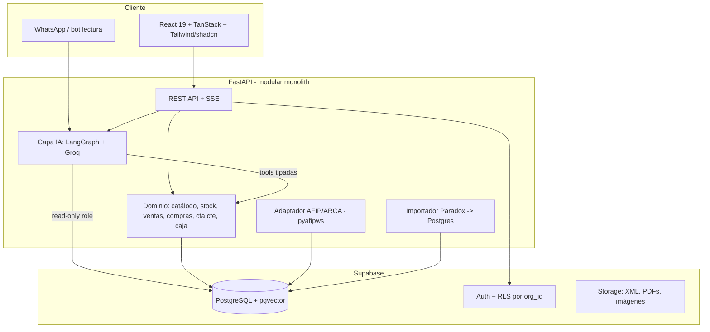
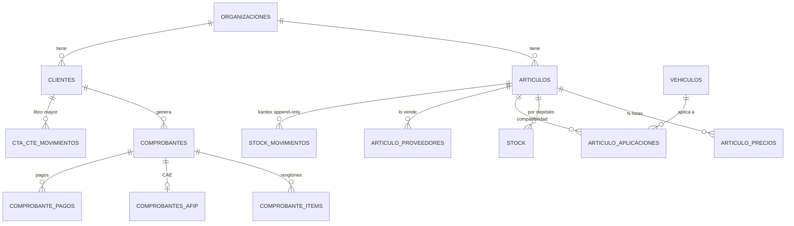

# RepuestOS — Blueprint de un sistema de gestión AI‑native para casas de repuestos

> Documento vivo. Sintetiza (1) el análisis del sistema legacy `Buloneria.exe`, (2) research de repos y librerías, y (3) el stack que ya venís manejando (FastAPI, Supabase/Postgres+pgvector, LangGraph, Groq, React). Nombre tentativo: **RepuestOS**.

---

## 0. TL;DR — las 6 decisiones que definen el proyecto

1. **No es un espejo del sistema viejo. Es un producto nuevo, greenfield y multi‑empresa.** El "espejo de solo lectura" que planteaba el análisis (oportunidad H) se **transforma en un importador/migración** desde Paradox → tu arma de onboarding.
2. **El dominio lo copiás del legacy; la implementación la hacés bien.** El modelo de datos y los flujos del `.exe` son oro. Los 10 "pecados" técnicos del viejo son tu checklist de qué arreglar por diseño (§2).
3. **Multi‑tenant desde el día uno** (RLS por `org_id` en Supabase). Sin esto no lo podés vender a más de un local.
4. **La IA es el titular, no un adorno.** Tres cosas: asistente conversacional sobre el negocio, reposición inteligente, guardián de márgenes. Todo lo demás (facturación, caja, cta cte) es la "columna vertebral" aburrida pero necesaria — y va **después** de la demo.
5. **El CV y la venta son dos objetivos distintos. No los mezcles.** Como pieza de portfolio, esto te vuela la cabeza a cualquier entrevistador junior *aunque no vendas una sola licencia*. Vender es más difícil (§3): el rubro está lleno de competidores maduros. Construí para impresionar; tratá la primera venta como piloto pro‑bono en un comercio piloto para tener caso de éxito.
6. **Demo primero, sistema completo después.** Vertical slice que impacte en 4‑6 semanas → grabás la publicidad → recién ahí completás el circuito transaccional real.

---

## 1. Qué extraemos del legacy (el dominio, condensado)

El circuito comercial completo que ya está resuelto conceptualmente en `Buloneria.exe` y que vas a replicar:

| Bloque | Del legacy | Al sistema nuevo |
|---|---|---|
| **Catálogo** | `Articulos` (código, detalle, costo, `CostoDolar`, 4 listas `Precio0..3` + `Margen0..3`, `PuntoPedido`, `CodigoBarra`, rubro/marca/modelo) | Tabla `articulos` + `articulo_precios` (N listas, no 4 columnas fijas) |
| **Stock** | `ArticulosStock` (cantidad por depósito, `CantidadComprometida`) | `stock` por (`articulo`, `deposito`) + movimientos append‑only |
| **Proveedores por artículo** | `ArticulosProveedores` (costo y código del proveedor) | `articulo_proveedores` |
| **Clientes + crédito** | `Clientes` (`LteCtaCte`, condición fiscal, vendedor, zona) | `clientes` |
| **Comprobantes** | cabecera (`Comprobantes`) + renglones (`ComprobantesDetalle`) + pagos (`ComprobantesFormaPago`) | `comprobantes` + `comprobante_items` + `comprobante_pagos` |
| **Tipos de comprobante** | `KComprobantes` (`Signo` +1/−1, `MueveStock`) + numerador (`KNumerador`) | `tipos_comprobante` + numeración por secuencia (§2.1) |
| **Cuenta corriente** | `ClientesCtaCte` / `ProveedoresCtaCte` (libro mayor Debe/Haber/Saldo) | `cta_cte_movimientos` append‑only, saldo calculado (§2.6) |
| **Compras** | `Compras` / `ComprasDetalle` (neto gravado, IVA, percepciones) | `compras` + `compra_items` |
| **Caja / cheques** | `CajaIngresos` / `CajaEgresos` / `ChequeMovimientos` | `caja_movimientos` + `cheques` |
| **Factura electrónica** | `FacturaElectronica` (XML enviado/recibido, `CAE`) | `comprobantes_afip` (CAE, vencimiento, XML) vía pyafipws (§4.7) |
| **Compatibilidad vehículo↔repuesto** | `Vehiculos` / `Articulos.IDModelo/IDMarca` **(estaban vacías)** | `vehiculos` + `articulo_aplicaciones` **+ seed asistido por IA** (§5.F) |

**Insight clave del análisis para no repetir su error:** el legacy *diseñó* compatibilidad por vehículo pero **nunca cargó el dato** (`Vehiculos` en 0). Esa es exactamente la feature que más vende en repuestos ("¿tenés el filtro para una Hilux 2016?") y es tu mayor diferencial y tu mayor trabajo de datos (§5.F).

---

## 2. Los 10 pecados del legacy → cómo el nuevo los arregla por diseño

Esto no es solo higiene técnica: **es tu narrativa de venta y de CV**. "El sistema que tenés hoy hace X mal; el mío lo hace bien porque…".

### 2.1 Numeración concurrente (`Max(ID)+1`) → **secuencias / bloqueo transaccional**
El viejo saca el número con `Select Max(ID)+1` y `Max(Numero)+1`: con dos cajas a la vez se duplica. En el nuevo:
- `id` interno: `bigint generated always as identity` (Postgres lo garantiza).
- Número fiscal: tabla `numeradores(org_id, tipo, pto_venta, ultimo)` actualizada dentro de una transacción con `SELECT … FOR UPDATE`, **y reconciliado contra el "último autorizado" de AFIP** (`CompUltimoAutorizado` de pyafipws) para factura electrónica.

### 2.2 Contraseñas en texto plano (`Usuarios.Clave` Alpha(10)) → **Supabase Auth (bcrypt) + RLS**
Nunca ves ni guardás un password. Auth delegado.

### 2.3 Motor frágil Paradox/BDE (se corrompe) → **PostgreSQL con integridad referencial real**
FKs reales, transacciones ACID, backups gestionados. Chau `pdoxrepair`, `LogError.DB` de 2,6 MB y tablas `...BK`.

### 2.4 Anchos de clave inconsistentes (código `Alpha(20)` referenciado como `Alpha(6)` → truncado) → **tipos consistentes + FK**
Un solo tipo para el código de artículo, referenciado por FK. Imposible truncar.

### 2.5 Copias basura en la misma carpeta (`Articulos20250129`, `...MAL...`) → **migraciones versionadas (Alembic) + un solo esquema**
El historial vive en Git, no en tablas fantasma.

### 2.6 Saldos guardados **y** recalculados que se desincronizan → **fuente única: libro mayor append‑only**
No guardás `Saldo` como columna mutable. `cta_cte_movimientos` es inmutable (Debe/Haber) y el saldo es una **vista**:
```sql
create view v_saldo_cliente as
select org_id, cliente_id, sum(haber) - sum(debe) as saldo
from cta_cte_movimientos group by org_id, cliente_id;
```
Para un local chico, calcular al vuelo alcanza y sobra. Si crece: vista materializada. **Nunca puede "no cerrar".**

### 2.7 Rutas hardcodeadas (`C:\FacturaElectronica\`) → **config por entorno (env vars / Supabase secrets)**

### 2.8 IVA en columnas opacas (`VGB1..4`, `KGB1..4`) → **IVA explícito por renglón**
Cada `comprobante_item` guarda su `alicuota_iva` (0/10.5/21/27) y el impuesto calculado. Auditable, cuadra con AFIP sin adivinar.

### 2.9 Tecnología sin soporte (Delphi 5, 1999, 32 bits) → **stack moderno con soporte y contratable**

### 2.10 Plantilla multi‑rubro con módulos muertos (`KDrogas`, `KGranos`, `ArticulosCristales`) → **un solo dominio: repuestos**
Nada de superficie de error de otros rubros.

---

## 3. Reframe estratégico: no es "un ERP más" (realidad competitiva)

Antes de enamorarte de vender: **el rubro ya está ocupado por players maduros e integrados** en Argentina. Lo verifiqué:

- **Líder Gestión (Wynges)** — vertical de repuestos/autopartes/motopartes, **licencia perpetua sin abono mensual**, con módulo de "repuestos alternativos y equivalencias", reposición automática, comprobantes por WhatsApp, actualización de precios por tipo de cambio, integraciones con MercadoLibre / TiendaNube / WooCommerce y hasta "API Rest + IA".
- **Sistar Simple** — ERP para repuestos, cloud, facturación electrónica de ARCA (ex‑AFIP), prueba gratis 30 días.
- **Dux Software** — gestión de repuestos con importación masiva, actualización automática de costos, sync con MercadoLibre, portal de cobros.
- **Contabilium** — POS + facturación que **funciona con o sin internet** (dato importante, §7).
- **Flexxus** — se vende como "estándar del rubro autopartes".

**Traducción honesta:**
- **No podés ganarles por amplitud** (integraciones, soporte, años de confianza). Un dev junior solo pierde esa pelea.
- **Tus cuñas reales son tres:**
  1. **UX AI‑native de verdad.** Algunos ya dicen "IA", pero es marketing bolt‑on. Un asistente conversacional que de verdad responde "¿qué clientes me deben más de $100.000 y cuáles están cerca del límite?" y arma la orden de compra sola, es otra categoría de experiencia.
  2. **Servicio hiper‑local y de alto contacto.** Operás en tu zona: instalás, capacitás y atendés en persona / por WhatsApp. Para una repuestera chica, "el pibe que viene, te lo configura y te atiende" vale oro frente a un SaaS remoto.
  3. **Migración directa desde el sistema viejo.** Los competidores importan de Excel. Vos podés importar **directo del Paradox/`.DB`** (ya demostraste que parseás el esquema). Para los muchos locales todavía atados a sistemas tipo Bulonería, eso elimina la objeción #1 ("pierdo mi historia").
- **Desacoplá objetivos:** construí para el CV (garantizado que suma) y usá un comercio piloto como **piloto pro‑bono → caso de éxito → primera referencia**. La venta escalable, si valida, viene después.

---

## 4. Arquitectura del sistema nuevo

### 4.1 Vista de alto nivel



### 4.2 Stack y por qué

| Capa | Elección | Por qué (para vos) |
|---|---|---|
| Backend | **FastAPI** (Python) | Ya lo manejás (proyecto previo propio). Async, tipado con Pydantic, ideal para colgar la capa de IA. |
| Datos | **Supabase (Postgres + pgvector + Auth + Storage + RLS)** | Multi‑tenant, auth y vectores out‑of‑the‑box. `numeric` para plata, integridad real. |
| ORM/migraciones | **SQLAlchemy 2.0 + Alembic** | Migraciones versionadas (arregla pecado §2.5). Data access tipado. |
| IA / agentes | **LangGraph + Groq (llama‑3.3‑70b o superior)** | Es literalmente lo que ya certificaste. Grafo con nodos, retries, human‑in‑the‑loop. |
| Embeddings / búsqueda | **pgvector + embeddings multilingües** | Reusás tu híbrido de un proyecto previo propio (keyword 0.4 + semántico 0.6). Multilingüe importa: es español. |
| Frontend | **React 19 + TanStack Router/Query + Zustand + Tailwind + shadcn/ui** | Tu stack exacto del CV. Consistencia total. |
| AFIP/ARCA | **pyafipws** (WSAA + WSFEv1) | Estándar libre y mantenido. **No reimplementes el SOAP de AFIP.** (§4.7) |
| Deploy | Backend en Render/Fly, front en Vercel, DB en Supabase | Ya usás Vercel/Render/HF. |

### 4.3 Multi‑tenancy (lo más importante para vender)

Cada fila lleva `org_id`. RLS en Supabase filtra por el `org_id` del JWT. Aunque un bug (o el LLM) intente leer de más, **la base no lo deja cruzar de tenant**. Patrón:
```sql
alter table articulos enable row level security;
create policy tenant_isolation on articulos
  using (org_id = (auth.jwt() ->> 'org_id')::uuid);
```
Esto convierte "un proyecto" en "un producto SaaS".

### 4.4 Modelo de datos nuevo — el núcleo hecho bien



Sketch de las tablas críticas (Postgres):
```sql
-- Plata SIEMPRE numeric, nunca float
create table articulos (
  id           bigint generated always as identity primary key,
  org_id       uuid not null,
  codigo       text not null,
  detalle      text not null,
  costo        numeric(14,4) not null default 0,
  costo_dolar  numeric(14,4),
  punto_pedido numeric(14,2) default 0,
  codigo_barra text,
  marca_id     bigint, modelo_id bigint, rubro_id bigint,
  embedding    vector(1024),           -- pgvector: búsqueda semántica sobre 'detalle'
  activo       boolean default true,
  unique (org_id, codigo)
);

-- N listas de precio (no Precio0..3 fijas)
create table articulo_precios (
  articulo_id bigint references articulos(id),
  lista_id    bigint not null,
  precio      numeric(14,2) not null,
  margen      numeric(6,2),
  primary key (articulo_id, lista_id)
);

-- Kardex append-only: el stock es la SUMA, nunca un número mutable suelto
create table stock_movimientos (
  id          bigint generated always as identity primary key,
  org_id      uuid not null,
  articulo_id bigint references articulos(id),
  deposito_id bigint not null,
  cantidad    numeric(14,2) not null,   -- +entra / -sale
  motivo      text not null,            -- 'venta','compra','ajuste','transferencia'
  ref_id      bigint,                   -- comprobante/compra que lo originó
  creado_en   timestamptz default now()
);

-- Compatibilidad (lo que el legacy nunca cargó)
create table vehiculos (
  id uuid primary key default gen_random_uuid(),
  org_id uuid not null,
  marca text not null, modelo text not null,
  anio_desde int, anio_hasta int,
  motor text, version text
);
create table articulo_aplicaciones (
  articulo_id bigint references articulos(id),
  vehiculo_id uuid references vehiculos(id),
  nota text,
  origen text,        -- 'catalogo_proveedor','extraido_ia','manual'
  confirmado boolean default false,
  primary key (articulo_id, vehiculo_id)
);
```

### 4.5 Backend como **monolito modular** (no microservicios)

Para un dev solo, microservicios es pegarse un tiro en el pie. Modular monolith, package‑by‑feature, con capa de dominio separada de los routers:
```
app/
  core/            # config, db, auth, rls helpers
  catalogo/        # models, schemas, service, router
  inventario/
  ventas/
  compras/
  ctacte/
  caja/
  afip/            # adaptador pyafipws
  ai/              # grafo LangGraph, tools, embeddings
  importador/      # Paradox -> Postgres (reusa tu parser)
  main.py
```
Regla: los routers no tocan la DB directo; llaman a `service`. Facilita testear (Vitest/pytest) y mantener.

### 4.6 Capa de IA (LangGraph) — el corazón del diferencial

Tres caminos distintos, **no todo es "LLM escribe SQL"**:

**(a) Preguntas / analítica → NL2SQL blindado (read‑only).**
Patrón multi‑nodo (probado en repos de referencia): `router → seleccionar tablas → generar SQL → validar (sqlglot) → ejecutar → sintetizar respuesta`, con **loop de auto‑corrección** (si falla, reintenta con el error inyectado). Blindajes:
- Rol de Postgres **solo lectura** para este camino.
- **RLS como red de seguridad** (aunque el LLM se equivoque, no cruza tenant).
- Streaming SSE para que se sienta vivo.
- *Ejemplos que tiene que responder:* "¿qué clientes me deben más de $100.000?", "top 10 productos más vendidos del mes", "¿qué está bajo punto de pedido del proveedor X?".

**(b) Acciones → tools tipadas (function calling), no SQL libre.**
Como tu AI Shopping Assistant de un proyecto previo propio (5 tools, hasta 8 rondas). Herramientas: `sugerir_orden_compra(proveedor)`, `consultar_deuda(cliente)`, `buscar_repuesto(texto, vehiculo)`, `recomponer_precios(cambio_dolar)`. Patrón **"el agente propone, el humano confirma"** (LangGraph `interrupt_before` / human‑in‑the‑loop): más seguro y **mejor para la demo** (el dueño siente que manda él). Esto refleja el "escribir por una cola controlada" del análisis.

**(c) Búsqueda → híbrida (keyword + pgvector) + filtro estructurado de compatibilidad.**
Reusás tu híbrido de un proyecto previo propio. "Filtro de aceite Gol Trend 2015" → semántico sobre `detalle` + join con `articulo_aplicaciones`.

**Extra CV:** exponé las tools (b) como un **MCP server**. Es exactamente lo que certificaste, y deja el asistente (y hasta otros clientes tipo Claude) usando tu backend. Poco laburo extra si las tools ya están tipadas.

Reusá tu **prompt injection guard** con strike/ban y rate limiting de un proyecto previo propio en todos los endpoints de IA.

### 4.7 AFIP/ARCA — **no lo escribas a mano**

`pyafipws` (libre, LGPL, mantenido a 2025) resuelve **WSAA** (autenticación con certificado) + **WSFEv1** (factura A/B/C/M, pide y guarda el **CAE**). Flujo: `WSAA.Autenticar('wsfe', cert, key)` → `WSFEv1.CrearFactura(...)` → `AgregarIva(...)` → `CAESolicitar()`.
Reglas que hereda el modelo (importantes): la numeración electrónica **arranca en 1 por punto de venta + tipo** (no se comparten talonarios), y la fecha no puede ser anterior al último comprobante. Empezá por **homologación** (`wswhomo.afip.gov.ar`), factura **C** primero (monotributo), y recién a producción con certificado real. Para la **demo, esto va stubbeado** (generás un CAE ficticio) — nadie factura de verdad en un video de publicidad.

### 4.8 Migración Paradox → Postgres (tu arma de onboarding)

Repurposás la oportunidad H del análisis: un job que lee los `.DB` de la carpeta `BasesBuloneria` y los vuelca al esquema nuevo (`Articulos`→`articulos`, `Clientes`→`clientes`, `Comprobantes`→`comprobantes`, etc.), mapeando los `Precio0..3` a `articulo_precios` y saneando los datos basura. Ya probaste que parseás el esquema; esto lo convertís en "**te importo tu sistema viejo en una tarde**".

---

## 5. Features de IA mapeadas a las oportunidades del análisis (A–H)

Reordenadas por **impacto en la demo** (no solo valor/esfuerzo), marcando qué está listo para mostrar vs qué depende de cargar datos.

| # | Feature | Estado para DEMO | Esfuerzo | Notas |
|---|---|---|---|---|
| **Asistente** | Hablá con tu negocio (NL2SQL + tools) | ⭐ Titular | Medio | Reusa function calling de un proyecto previo propio |
| **A** | Reposición inteligente de stock | ✅ Listo | Bajo‑medio | `punto_pedido` + velocidad de venta (histórico) + proveedor → orden sugerida |
| **D** | Guardián de precios/márgenes | ✅ Listo | Bajo | Detecta margen negativo/erosionado por dólar; propone recomposición |
| **E** | WhatsApp: consulta stock y precio | ✅ Demo‑able | Medio | Bot solo lectura + búsqueda semántica |
| **F** | Compatibilidad repuesto↔vehículo | ⚠️ Requiere seed | **Alto (dato)** | El moat. El software es fácil; **el dato no existe** — hay que cargarlo (§5.F) |
| **C** | Cobranzas por WhatsApp/email | 🔜 Fase 2 | Medio | Ojo calidad de teléfonos/emails (campos libres) |
| **B** | Control de CAE (facturación) | 🔜 Fase 2 | Medio | Solo tiene sentido con AFIP real |
| **G** | Auditoría / anomalías | 🔜 Fase 2 | Medio | Stock negativo, cheques sin conciliar, saldos raros |
| **H** | ~~Espejo~~ → Migración Paradox | Fase 2 (onboarding) | Medio | Reconvertido en importador |

### 5.F — Cómo resolver la compatibilidad (tu mayor diferencial)

El estándar global de fitment es **ACES/PIES** (Auto Care Association, EE.UU./Canadá/México), pero el VCdb (base de vehículos) es **por suscripción paga y centrado en Norteamérica**; el equivalente internacional/aftermarket es **TecDoc**. Para una repuestera chica del interior, licenciar eso es sobredimensionado y caro.

**Estrategia realista y AI‑assisted:**
1. **Extraé de lo que ya existe:** muchas descripciones del legacy ya traen el vehículo embebido ("PASTILLA FRENO HILUX 2016..."). Un pipeline con LLM parsea `detalle` → `{marca, modelo, año}` y puebla `articulo_aplicaciones` con `origen='extraido_ia', confirmado=false`.
2. **Catálogos de proveedores:** muchos distribuidores publican "aplicaciones" por código. Scrapeás/importás y normalizás.
3. **Confirmación humana:** se muestra como "compatibilidad sugerida" y el del mostrador confirma. El dato bueno se acumula (data flywheel).
4. **Para la demo:** cargá un slice curado — top ~100 repuestos × ~10 vehículos comunes en AR (Hilux, Gol, Corsa, Amarok, Ranger, 208, Cronos, etc.) — para que "buscá el repuesto para un Gol Trend 2015" funcione impecable en el video.

Si algún día escalás, TecDoc/ACES es el camino "pro", pero **no lo necesitás para arrancar ni para vender localmente**.

---

## 6. Repos y piezas para robar (no reinventar)

| Repo / recurso | Qué robar | Link |
|---|---|---|
| **InvenTree** (Python/Django) | Modelo de datos de partes/stock, kardex, sistema de plugins, control de stock de bajo nivel | github.com/inventree/inventree |
| **opensourcepos** | Checklist de features de un POS real (tiene demo live) | github.com/opensourcepos/opensourcepos |
| **qpos / Triangle POS** | Features "must‑have": low‑stock alerts, dynamic pricing, bulk import, reportes | github.com/qtecsolution/qpos |
| **mallahyari/langgraph‑sql‑agent** (+ artículo "production‑ready SQL agent") | **La arquitectura exacta** del asistente: nodos Router/TableSelector/SQLGen/Validator/Viz, retries, SSE, human‑in‑the‑loop. FastAPI + React | github.com/mallahyari/langgraph-sql-agent |
| **alejbormeg/NL2SQL‑LangGraph** | FastAPI + Postgres + **pgvector** + soporta **español**; planner + feedback + RAG de contexto | github.com/alejbormeg/NL2SQL-LangGraph |
| **WrenAI** | Agente GenBI open‑source, ideas de UX conversacional sobre datos | (buscar "WrenAI" en GitHub) |
| **pyafipws** | **Toda** la integración AFIP/ARCA (WSAA + WSFEv1 + CAE). No escribir SOAP a mano | github.com/reingart/pyafipws |

De cada uno tomás piezas, no el todo: dominio de partes de InvenTree, patrón de agente de mallahyari/alejbormeg, features de POS de qpos, AFIP de pyafipws.

---

## 7. Roadmap por fases (realista para un dev solo con laburo + facu)

**Fase 0 — Fundaciones (1–2 semanas).**
Repo, Supabase, esquema núcleo (articulos, precios, stock, clientes, vehiculos, aplicaciones), Auth + **RLS multi‑tenant**, Alembic, y un **seed que importe un slice real** del Paradox (reusás tu parser). Entregable: API skeleton + login + datos reales.

**Fase 1 — El "wow" para la demo (3–4 semanas). ESTO es lo que grabás.**
- Catálogo + **búsqueda híbrida** (keyword + pgvector) — reuso de un proyecto previo propio.
- **Compatibilidad** con seed curado (§5.F) → "repuesto para tal auto".
- **Asistente conversacional** (LangGraph): NL2SQL read‑only + 2‑3 tools tipadas, streaming SSE. El titular.
- **Reposición inteligente (A)** + **Guardián de márgenes (D)**: dashboards, dato ya disponible, alto impacto.
- **Frontend pulido** (dashboard + catálogo + panel de chat). Es publicidad: la estética vende.
- AFIP **stubbeado**. Entregable: **demo deployada con datos realistas → video de publicidad**.

**Fase 2 — Sistema real / primer cliente (según interés que genere la demo).**
- Ventas/comprobantes con numeración correcta + movimiento de stock transaccional.
- Cuenta corriente (ledger append‑only) + caja + cheques.
- Compras + actualización de costos.
- **AFIP en homologación** (pyafipws, factura C primero).
- **Migración Paradox → nuevo** como onboarding.
- Cobranzas WhatsApp (C) + control CAE (B) + auditoría (G).
- **Piloto pro‑bono en un comercio piloto → caso de éxito documentado.**

**Fase 3 — Producto/SaaS (si valida comercialmente).**
Multi‑sucursal, **offline resiliente** (§8), integraciones (MercadoLibre, WhatsApp API), roles/permisos, AFIP en producción, panel de administración de tenants, billing.

---

## 8. Riesgos y decisiones abiertas (para hablar antes de codear)

1. **Offline en el mostrador.** Los competidores (ej. Contabilium) venden "funciona con o sin internet". Un SPA cloud que muere sin conexión es una objeción real en la caja. Para la **demo** no importa (online‑only). Para **vender**, hay que decidir: ¿PWA con cola local?, ¿o asumir online‑only en v1? Es un lift grande — no lo resolvemos ahora, pero tenelo en el radar.
2. **Dato de compatibilidad.** Es tu moat y tu cuello de botella. La estrategia AI‑assisted (§5.F) lo hace viable, pero es trabajo de datos continuo.
3. **Certificado AFIP.** Para producción necesitás CUIT + certificado por cada local (o esquema de facturación por cuenta del cliente). Para demo, stub.
4. **Alcance vs tiempo.** El riesgo #1 del proyecto no es técnico: es **querer construir el ERP completo y no terminar nunca**. La regla de oro: **Fase 1 tiene que estar deployada y grabada antes de tocar facturación real.**
5. **Competencia.** Asumí que no ganás por amplitud. Ganás por UX AI‑native + servicio local + migración desde el viejo. Si eso no diferencia lo suficiente en tu zona, el proyecto **igual vale como pieza de CV** — ese objetivo está asegurado.

---

*Próximo paso sugerido: cerrar las decisiones de §0 y §8, y arrancar Fase 0 con el esquema + el importador del slice real de datos. Cuando quieras, te armo el DDL completo del núcleo o el esqueleto del grafo LangGraph.*
